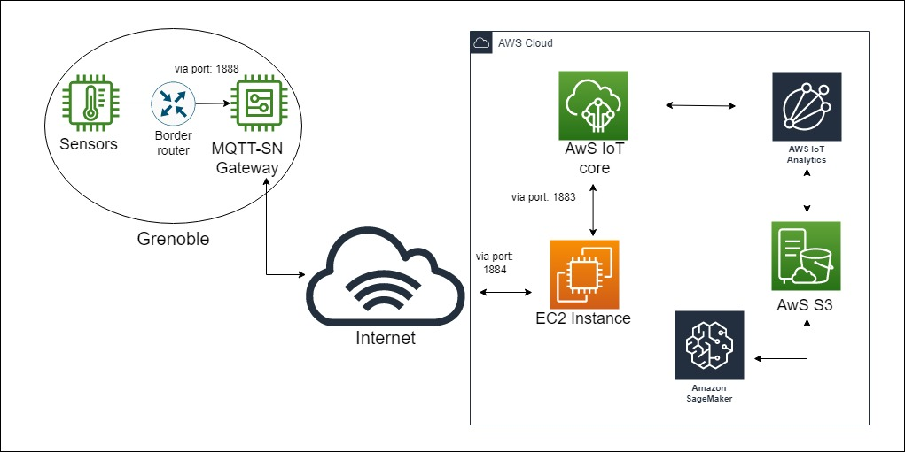
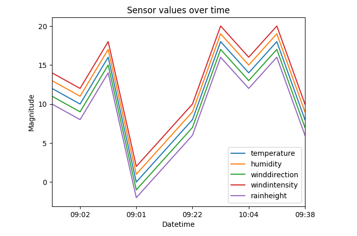

# HIS_Project: IoT - From Microcontroller to the Cloud
High integrity Systems' Project - Frankfurt University of Applied Sciences.

Co-authors: 
- Phuc Hoc Tran - 1235133 
- Jaime Sanchez Cotta - 1430488

This Markdown file is written by Phuc Hoc Tran (1235133)

The aim of the project is to create an application which sends an MQTT-SN message with artificial sensor's measurement (client is deployed on FiT/IoT-Lab) as its content to AwS cloud (in this project, we used AwS IoT Core) and visualize the measurement on AwS SageMaker.

---

## Table of Contents
* [Prerequisites](#prerequisites)
* [Architecture](#architecture)
* [EC2 Instance & AwS IoT Core Setup](#ec2-instance--aws-iot-core-setup)
* [MQTT-SN Gateway Setup](#mqtt-sn-gateway-setup)
* [AwS S3](#aws-s3)
* [AwS IoT Analytics](#aws-iot-analytics)
* [AwS SageMaker](#aws-sagemaker)
* [Contribution](#contribution)

---

## Prerequisites: 
- A registered account on FiT IoT-Lab
- [RIOT](https://github.com/RIOT-OS/RIOT "RIOT") application 
- AwS Account (either free tier, or paid - if you are wealthy enough :-) )
- [Paho MQTT-SN Gateway](https://github.com/eclipse/paho.mqtt-sn.embedded-c/tree/master/MQTTSNGateway "Paho MQTT-SN Gateway") 
- To be updated...

- Bash/shell knowledge.
- C programming. 

---
## Architecture: 
### 1. Overarching idea: 

- In this project, the following applications from **RIOT** are ultilized: 
    * emcute_mqttsn: MQTT-SN client, which publishes the sensor data and subscribes to the MQTT-SN Gateway.
    * Border Router.
### 2. In details:
~~some detail explanation here~~
___
## Sensors: 
Based on the requirement, we decided to create an emulated sensor with values follow a Zig Zag pattern, as follow: 
```c
/* function to create Zig Zag pattern */
int posRead =0;
int vMax = 20;
int arrayAux[41];

int zigZag_val(int x){
    if(x>=0&&x<vMax){
    return x;
  }
  else if(x>=vMax&&x<2*vMax){
    return 2*vMax-x;
  }
  else if(x>=2*vMax){
    return zigZag_val(x-2*vMax);
  }
  else if(x<0){
    return zigZag_val(x+2*vMax);
  }
  else return 0;
}

```
And then generate the value: 

**Note that:** the temperature sensor values go from 0 to 20 increasing by two. The rest of the sensor values follow the same function but with the change of +1 in humidity (values from 1 to 21), -1 in wind direction, +2 in values of wind intensity, and –2 in rain height.

```c
/* generate Zig Zag pattern */
void gen_sensors_values(t_sensors* sensors, int position){
  int x;
  int i = 0;
  
  x=-2*vMax;
  while(x<=2*vMax){
    arrayAux[i] = zigZag_val(x);
    x=x+2;
    i++;
  }
  sensors->temperature = arrayAux[position];
  sensors->humidity = arrayAux[position]+1;
  sensors->windDirection = arrayAux[position]-1;
  sensors->windIntensity = arrayAux[position]+2;
  sensors->rainHeight = arrayAux[position]-2;
}
```
One should first familarize oneself with this [tutorial](https://www.iot-lab.info/learn/tutorials/riot/riot-mqtt-sn-a8-m3/ "MQTT-SN with public IPv6 network and A8-M3 nodes") from FiT/IoT-Lab. Afterwards, the same chain of commands is used (except for deploying the MQTT-Broker - step 9 in the mentioned tutorial) to initialize the sensor and Border Router. Then, the sensor's values will be sent to IoT Core via MQTT-SN Gateway using: 
```
pub_sensor <GatewayIPv6Address> <GatewayPort> [CustomTopic]
```

The topic has already been predefined in the below function. If one wishes to publish to another topic, one should also include the topic forwarding rule in the _bridge.conf_ file deployed on EC2 first, then add the topic argument in the _pub_sensor_ command later. 
```c
static int sensors_read(int argc, char **argv){
    emcute_topic_t t;
    ...
    //Predefined topic: 
    char topic_buf[100] = "his_project/his_iot/sensor_data";
    char* topic = (char*)&topic_buf;
    ...
```
___
## EC2 Instance & AwS IoT Core Setup:
Multiple online sources provided ways to set up the EC2 instance and AwS IoT Core. One among which is this great [article]("https://aws.amazon.com/blogs/iot/how-to-bridge-mosquitto-mqtt-broker-to-aws-iot" "How to Bridge Mosquitto MQTT Broker to AWS IoT") from AwS themselves to setup Brokers on both EC2 and AwS IoT Core. 

Fortunately, although our accounts are not allowed to use IAM servce, we managed to bypass that by simply creating an EC2 instance as the tutorial instructed, and manually create an AwS IoT Core's Thing and attach policy to it. Then, follow the steps on the article above to setup the brokers.

Afterwards, simply bridging the two brokers by pasting the AwS IoT Core's endpoint (can be found via AwS IoT Core's Website/Setting/Device data endpoint, usually in the form *xxx-ats.Iot.REGION.amazonaws.com*) onto __address__ line in the bridge.conf: 
```conf
# ============================================================
# Bridge to AWS IOT
# ============================================================

connection awsiot

## Paste your AWS IoT Core ATS endpoint in the form of xxxxxxxxxxxxxxx-ats.iot.<region>.amazonaws.com:8883

address xxxxxxxxxxxxxxx-ats.iot.<region>.amazonaws.com:8883

# Specifying which topics are bridged and in what fashion
topic awsiot_to_localgateway in 1
topic localgateway_to_awsiot out 1
topic both_directions both 1
## additional line: predefined topic
topic his_project/his_iot/sensor_data both 1
## end addtional line

# Setting protocol version explicitly
bridge_protocol_version mqttv311
bridge_insecure false

# Bridge connection name and MQTT client Id, enabling the connection automatically when the broker starts.
cleansession true
clientid bridgeawsiot
start_type automatic
## 2 additional lines: Allowing receive all messages sent to port 1884
listener 1884 0.0.0.0
allow_anonymous true
## end 2 additional lines
notifications false
log_type all

# ============================================================
# Certificate based SSL/TLS support
# ============================================================

#Path to the rootCA
bridge_cafile /etc/mosquitto/certs/rootCA.pem

# Path to the PEM encoded client certificate
bridge_certfile /etc/mosquitto/certs/cert.crt

# Path to the PEM encoded client private key
bridge_keyfile /etc/mosquitto/certs/private.key

#END of bridge.conf
```
Afterwards, on EC2 terminal (using __ssh -i [EC2Keys].pem ubuntu@[EC2IPv4Address]__), run these commands to start the bridge:
```
sudo service mosquitto stop
mosquitto -c /etc/mosquitto/conf.d/bridge.conf
```
**IMPORTANT:** Note that, the bridge.conf is specified on EC2 instance, and those 2 additional lines is for allowing anonymous connection at port 1884. We will use this port for the Gateway deployed on FiT/IoT-Lab to connect to the instance. 
___
## MQTT-SN Gateway Setup:
### 1. Initial setup:
Based on the experience of the co-author, setting up the latest Paho was quite cumbersome and somewhat difficult, since the creator of Paho Mosquitto package changed the name convention in the latest release, and all the online sources used the older version (hence, the old name convention). Therefore, we decided to opt for the old version for this project. Simply enter these commands in the CLI:  
```
wget --progress=dot:giga --no-check-certificate -O paho.mqtt-sn.embedded-c.zip https://github.com/eclipse/paho.mqtt-sn.embedded-c/archive/f2dcda358f21e264de57b47b00ab6165bab4da18.zip
unzip paho.mqtt-sn.embedded-c.zip
rm paho.mqtt-sn.embedded-c.zip 
mv paho.mqtt-sn.embedded-c-f2dcda358f21e264de57b47b00ab6165bab4da18 paho.mqtt-sn.embedded-c
cd paho.mqtt-sn.embedded-c/MQTTSNGateway 
```
To run the Gateway, one must build the application first

```
./build.sh udp6
cd bin
./MQTT-SNGateway
```

### 2. Custom configuration to deploy on FiT/IoT-Lab: 
The Gateway is deployed onto FiT/IoT-Lab's node. Before building the application, make sure that the Broker bridge on EC2 has already [started](#ec2-instance--aws-iot-core-setup), the IPv4 Address of the EC2 instance is known. 

Next, we need to retrieve the IPv6 address of FiT/IoT-Lab's node, by simply run: 
```
root@node-a8-xx: ip -6 -o addr show eth0
>> 2: eth0    inet6 2001:660:3207:400::66/64 scope global        valid_lft forever preferred_lft forever
```

Once we have both addresses, locate the __gateway.conf__ file at _paho.mqtt-sn.embedded-c/MQTTSNGateway_ and configure: 
```conf
# config file of MQTT-SN Gateway
BrokerName= <Paste the EC2 IPv4 Address Here>
BrokerPortNo=1884 # When change this, also change the bridge.conf file on EC2
BrokerSecurePortNo=8883
...
# UDP6
GatewayUDP6Bind= <Paste the Node IPv6 Address Here> 
GatewayUDP6Port=1888 # Can also be any port you want
GatewayUDP6Broadcast=FF02::1
GatewayUDP6If=wpan0
GatewayUDP6Hops=1
...
```
Afterwards, build the Gateway and run as instructed above (Whilst ssh in the node).
___
## AwS S3:
Before moving on to setup the IoT Analytics, we first need to create 3 S3 buckets, one for IoT Analytics __channel__, one for the __data store__, and one for the __data set__. The following are steps to recreate:
1. Navigate to the __S3 Management Console__
2. Choose __Create Bucket__
    * **Bucket name**: Give the bucket a unique name (must be globally unqiue) and append it with '-channel'. 
    * **Region**: Should be kept the same.
3. Click **Next** and keep all options default. Click on **Create bucket** to finish the creation.
4. Repeat steps 1-3 twice to fnish creating the required buckets. Use the appendices '-datastore' and '-dataset' to differentiate the buckets.

On the *bucketName-*__datastore__, Appropriate permission for IoT Analytics to access Data Store bucket must be given:
1. Click on the datastore bucket (ending with *-datastore*)
2. Navigate to the *permission* tab
3. Click on **Bucket Policy** and enter the following JSON policy (be sure to clude your s3 bucketname):
```json
{
    "Version": "2012-10-17",
    "Id": "IoTADataStorePolicy",
    "Statement": [
        {
            "Sid": "IoTADataStorePolicyID",
            "Effect": "Allow",
            "Principal": {
                "Service": "iotanalytics.amazonaws.com"
            },
            "Action": [
                "s3:GetBucketLocation",
                "s3:GetObject",
                "s3:ListBucket",
                "s3:ListBucketMultipartUploads",
                "s3:ListMultipartUploadParts",
                "s3:AbortMultipartUpload",
                "s3:PutObject",
                "s3:DeleteObject"
            ],
            "Resource": [
                "arn:aws:s3:::<your bucket name here>",
                "arn:aws:s3:::<your bucket name here>/*"
            ]
        }
    ]
}
```
4. Click **Save**
___
## AwS IoT Analytics:
### 1. IoT Analytics Channel
Next, we will create the IoT Analytics channel that will consume data received at the IoT Core Broker and store it into S3 bucket. 
1. Navigate to __AwS IoT Analytics__ console
2. Navigate to __Channels__
3. Create a new channel
    * **ID**: sensorStreamDataChannel
    * **Choose the storage type**: Customer Managed S3 Bucket, and choose the S3 channel bucket created in the previous step (see: [create S3 buckets](#aws-s3))
    * **IAM Role**: Because of our subscription, choose _Lab Role_
4. Click __Next__ and leave everything blank. Then click __Create Channel__
### 2. IoT Analytics Data Store for the pipeline
1. Navigate to __AwS IoT Analytics__ console
2. Navigate to __Data stores__
3. __Create__: 
    * **ID**: sensorStreamDataStore
    * **Choose the Storage Type**: Customer Managed S3 Bucket -> choose the S3 data store bucket.
    * **IAM ROLE**: Choose _Lab Role_
4. Click __Next__ and __Create data store__
### 3. IoT Analytics Pipeline
1. Navigate to __AwS IoT Analytics__ console
2. Navigate to __Pipelines__
3. __Create__:
    * **ID**: sensorStreamDataPipeline
    * **Pipeline source**: sensorStreamDataChannel
4. Click **Next**
5. **Pipeline Output**: click 'Edit' and choose 'sensorDataStreamStore'
6. Click __Create Pipeline__

At this step, the IoT Analytics Pipeline is now set up.  
### 4. IoT Analytics Data Set
1. Navigate to __AwS IoT Analytics__ console
2. Navigate to __Data sets__
3. Choose __Create a data set__
4. Select __Create SQL__
    * **ID**: sensorStreamDataSet
    * **Select data store source**: sensorStreamDataStore - **this** is the _S3 bucket_ containing the data
5. Click **Next**
6. Keep the default SQL statement, which should read ``SELECT * FROM sensorstreamdatastore`` and click **Next**.
7. Keep all options as default and click **Next**.
8. At **Set query schedule**, choose the **Frequency**: Every 1 minute. This will query to run regularly to refresh the dataset. click **Next** until reaching the "Configure dataset content relivery rules".
9. Click **Add rule**
10. Choose __Deliver result to S3__
    * **S3 buket**: select the S3 bucket that ends with '-dataset'. 
    * **Bucket key expression**: output.csv
    * **IAM Role**: LabRole 
11. Click **Create data set** to finalize the creation of data set.
### 5. Create Message Routing Rule from IoT Core to IoT Analytics
1. Navigate to __AwS IoT Core__ console
2. Navigate to __Message routing__
3. Navigate to __Rules__
4. Click __Create rule__
    * **Rule name**: sensorDataStreamRule, then click **Next**
    * **SQL Statement**: ``SELECT temperature, humidity, windDirection, windIntensity, rainHeight, timestamp() as time FROM 'his_project/his_iot/sensor_data'``, make sure the **SQL version** is 2016-03-23. Afterwards, click **Next**
    * **Rule actions**: Choose **IoT Analytics** (_Send a message to IoT Analytics_)
    * **Channel name**: sensorstreamdatachannel
    * **IAM Role**: LabRole
5. Review the rule, and click **Create rule**. 

At this point, the every received messages will be routed to IoT Analytics and save to the created S3 buckets. 
___
## AwS SageMaker:
### 1. On AwS IoT Analytics:
1. Navigate to __AwS IoT Analytics__ console
2. Navigate to __Notebooks__
3. Click __Create Notebook__
4. At __Select a template__, choose __IoTA blank template__
5. To setup a notebook: 
    * **Notebook name**: sensorDataNotebook
    * **Select dataset source**: sensorstreamdataset
    * **Select a notebook instance**: We don't have that yet, therefore, click the *Create new instance* drop down menu, give it the *instance name, instance type, and Role name*(again, **LabRole) and click *Create new instance*. Once a new instance is running, simply choose that instance. 
6. Click **Next** to review, then click **Create notebook**.

Now we have a running Notebook to (which is a bit overkill) visualize the sensor data. Wait until the notebook instance status goes from *Pending* to **in service**, then we are good to go. 

### 2. In the Notebook: 
1. On the same console, click **Actions** -> **View in AwS SageMaker** -> **Open JupyterLab**.
2. Navigate to **IoTAnalytics** folder on the left.
3. 1. Click the **sensordatanotebook.ipynb** and paste the code from the *.ipynb in this git repo, or.
   2. Upload the *.ipynb in this git repo onto the SageMaker directory, and runs all the cell to see the visualization!


___
# Contribution: 
| Task/Function                                                   | Responsible                         |
| ----------------------------------------------------------------| ------------------------------------|
| Sensor's ZigZag function                                        | Jaime Sanchez Cotta                 |
| Sensor's Publish function                                       | Phuc Hoc Tran + Jaime Sanchez Cotta |
| AwS EC2 and Mosquitto Broker Setup                              | Phuc Hoc Tran                       |
| AwS IoT Core, Message Routing Rule Setup and Mosquitto Bridge   | Phuc Hoc Tran                       |
| Paho's MQTT-SN Gateway Setup                                    | Phuc Hoc Tran                       |
| AwS IoT Analytics Setup                                         | Phuc Hoc Tran                       |
| AwS S3 Buckets Setup                                            | Phuc Hoc Tran                       |
| AwS SageMaker Setup                                             | Phuc Hoc Tran                       |
| Sensor Data Visualization (Python)                              | Phuc Hoc Tran                       |


